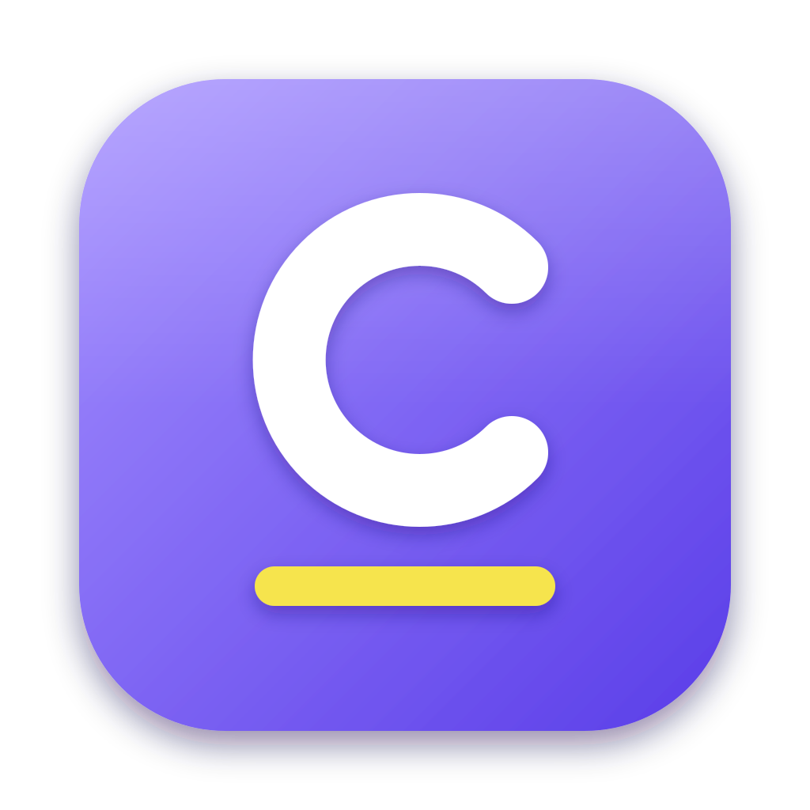
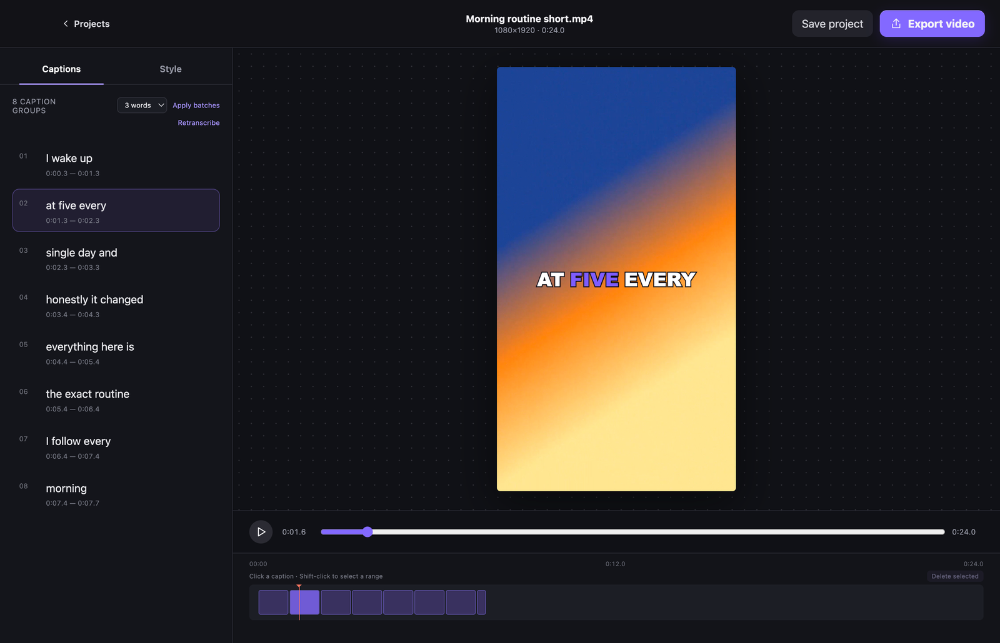
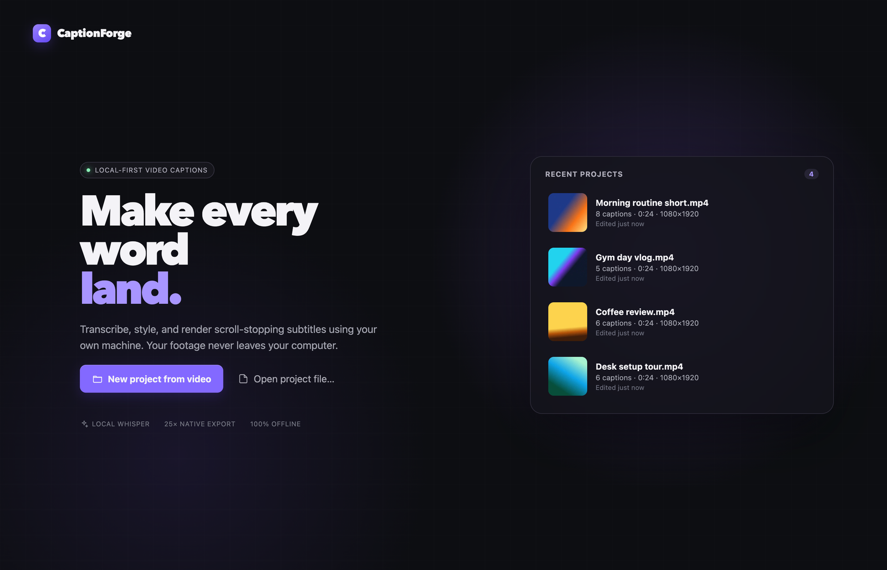
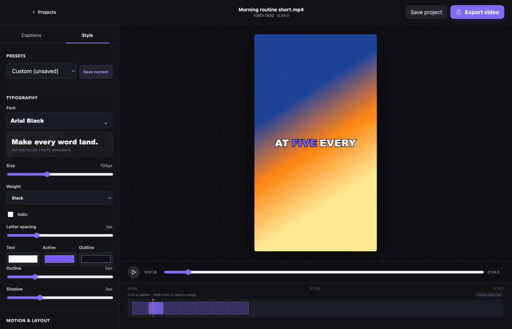
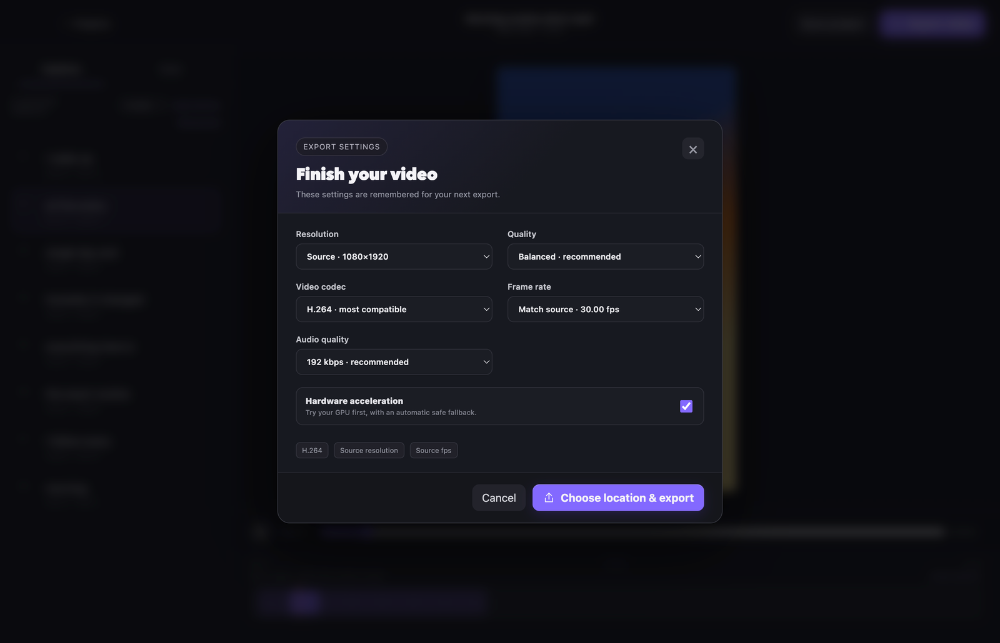

<p align="center">
  
</p>

<h1 align="center">CaptionForge</h1>

<p align="center">
  Free, offline, word-by-word captions for YouTube Shorts, TikToks, and Reels.<br>
  <a href="https://github.com/IsaiahPapa/captionforge/releases/latest"><strong>Download for Windows or macOS</strong></a>
</p>



I made CaptionForge for my own YouTube Shorts. Every captioning tool I found was a subscription, capped the export resolution, added a watermark, or rendered slowly in the browser. This one runs on your own computer, has no limits, and costs nothing. It's great if you just want quick, good-looking subtitles and a clean render without fighting a website.

## Download

Grab the latest installer from the [Releases page](https://github.com/IsaiahPapa/captionforge/releases/latest).

- **Windows 10/11 (64-bit):** run `CaptionForge.Setup.<version>.exe`. The installer isn't code-signed yet, so Windows will show "Windows protected your PC": click **More info → Run anyway**.
- **macOS (Apple Silicon):** open the `.dmg` and drag CaptionForge to Applications. It isn't notarized yet, so the first time, right-click the app and choose **Open**.

Everything it needs is built in. The first time you use a speech model, CaptionForge downloads it automatically (75 MB to 1.5 GB depending on the model); after that it works completely offline.

## What it does

- **Transcribes on your machine** with Whisper (via whisper.cpp), including word-level timing. Your footage never gets uploaded.
- **Word-by-word highlighting**, the Shorts/TikTok style: the current word lights up in its own color, with optional pop or fade.
- **Full styling control:** any font installed on your computer, size, weight, italics, letter spacing, text/highlight/outline colors, outline and shadow, top/center/bottom placement with fine offset, uppercase, and timing nudges.
- **Edit the transcript** in caption groups, rebatch to 1–6 words per caption, delete or fix captions; word timing is preserved when you fix a typo.
- **Exports at full resolution** with no length limit and no watermark, using FFmpeg and your GPU's hardware encoder when available (H.264 or HEVC).
- **Projects autosave**, and recent projects are one click away on the home screen.

| Recent projects | Styling | Export |
|---|---|---|
|  |  |  |

## Feedback

This is a personal project I'm sharing as-is. If something breaks or you have ideas, [open an issue](https://github.com/IsaiahPapa/captionforge/issues).

---

## Development

CaptionForge is an Electron + React app. The main process runs FFmpeg and whisper.cpp as child processes; the renderer is the editor. See [docs/ARCHITECTURE.md](docs/ARCHITECTURE.md) for details.

**Prerequisites:** Node.js 22 or newer. On macOS, CMake (`brew install cmake`) is needed once to compile whisper.cpp with Metal.

```bash
npm install
npm run dev     # builds/downloads whisper.cpp into vendor/ on first run, then starts the app
npm test
```

FFmpeg and ffprobe come from npm. Speech models download on first use into `<userData>/models` and are verified against pinned checksums.

### Building installers

```bash
npm run dist:mac   # release/CaptionForge-<version>-arm64.dmg
npm run dist:win   # release/CaptionForge Setup <version>.exe (Windows x64)
```

`dist:win` cross-builds from macOS and needs Wine (`brew install --cask wine-stable`). It first fetches the Windows `ffmpeg.exe` and sharp binaries into `node_modules` beside the host ones; each package picks its own at runtime. Both installers are self-contained: FFmpeg, ffprobe, and whisper.cpp ship inside the app. The Windows build uses the official whisper.cpp CPU release plus app-local MSVC runtime DLLs; the macOS build is compiled from the same version with Metal. Versions and checksums are pinned in `scripts/fetch-whisper.cjs`.

Set `CAPTIONFORGE_WHISPER_BIN` to use a different whisper.cpp `whisper-cli` binary.

Copyright © 2026 Isaiah Paparella. All rights reserved.
